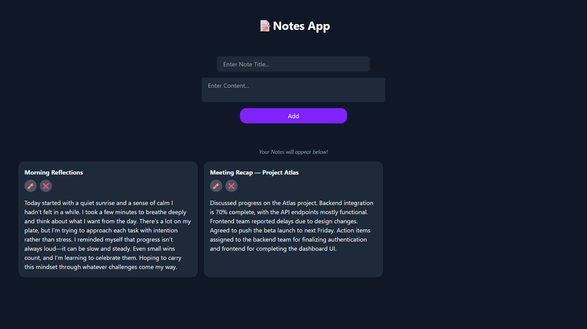

# 📝 React Notes App

A minimal **Notes App** built with **React + Vite + TailwindCSS**.  
This project is part of my daily grind (Day 63) on the journey to becoming a founder.  

## ✨ Features
- Add new notes with **title + content**
- Auto-expanding **textarea** (no ugly scrollbars)
- **Edit notes inline** (title + content)
- **Delete notes** with a single click
- **LocalStorage persistence** (notes survive page refresh)
- Clean, responsive UI with TailwindCSS

## 🚀 Tech Stack
- React (with hooks: `useState`, `useEffect`, `useRef`)
- Vite (fast dev/build tool)
- TailwindCSS (utility-first styling)

## 💡 Learnings
- Controlled inputs for forms
- Conditional rendering for **edit vs view modes**
- Handling arrays with `.map()` and `.filter()`
- Using **localStorage** for persistence
- Auto-resizing textareas with `useRef` + `useEffect`

## 📦 Setup
Clone and install:

- git clone <your-repo-url>
- cd notes-app
- npm install
- npm run dev

---

## 🌍 Live Demo
[Click Here]()

## Preview

## MIT Licence
